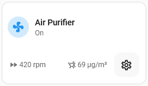

# Air Purifier card

## Description

A modified Fan card that allows for control of the air purifier through tapping the icon to toggle it on or off. Long pressing the icon will bring pop up the more-info card

This card will additionally show device entities for the Air Quality Index and Fan Speed (RPM)

A settings button allows quick access to the device info page if the user is an Admin

## Configuration variables

All the options are available in the lovelace editor but you can use `yaml` if you want.

| Name                   | Type    | Default  | Description                                                                         |
| :--------------------- | :------ | :------- | :---------------------------------------------------------------------------------- |
| `entity`               | string  | Required | Fan entity                                                                          |
| `name`                 | string  | Optional | Custom name                                                                         |
| `icon`                 | string  | Optional | Custom icon                                                                         |
| `icon_animation`       | boolean | `false`  | Animate the icon when fan is `on`                                                   |
| `layout`               | string  | Optional | Layout of the card. Vertical, horizontal and default layout are supported           |
| `fill_container`       | boolean | `false`  | Fill container or not. Useful when card is in a grid, vertical or horizontal layout |
| `show_device_controls` | boolean | `true`   | Show the device control buttons                                                     |
