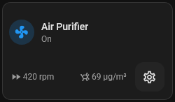

# Air Purifier card

## Description

A modified Fan card that allows for control of the air purifier through tapping the icon to toggle it on or off. Long pressing the icon will bring pop up the more-info card

This card will additionally show device entities for the Temperature, Hunidity, Air Quality Index, and Fan Speed (RPM)

## Configuration variables

All the options are available in the lovelace editor but you can use `yaml` if you want.

| Name             | Type    | Default  | Description                       |
| :--------------- | :------ | :------- | :-------------------------------- |
| `entity`         | string  | Required | Fan entity                        |
| `name`           | string  | Optional | Custom name                       |
| `icon`           | string  | Optional | Custom icon                       |
| `icon_animation` | boolean | `false`  | Animate the icon when fan is `on` |
