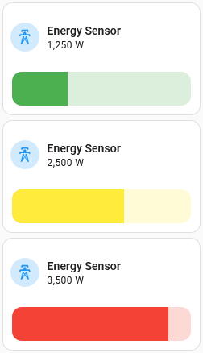
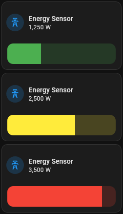

# Bar card

## Description

A horizonal bar card allows you to display a numeric sensor. Segments can be used to change the color based on the value

## Configuration variables

The options for the segments can only be configured in `yaml`, all the options are available in the lovelace editor.

| Name             | Type      | Default  | Description                                                                         |
| :--------------- | :-------- | :------- | :---------------------------------------------------------------------------------- |
| `entity`         | string    | Required | Entity                                                                              |
| `name`           | string    | Optional | Custom name                                                                         |
| `icon`           | string    | Optional | Custom icon                                                                         |
| `icon_color`     | string    | `blue`   | Custom color for icon when entity is state is active                                |
| `layout`         | string    | Optional | Layout of the card. Vertical, horizontal and default layout are supported           |
| `fill_container` | boolean   | `false`  | Fill container or not. Useful when card is in a grid, vertical or horizontal layout |
| `show_icon`      | boolean   | `true`   | Show the icon                                                                       |
| `show_name`      | boolean   | `true`   | Show the name                                                                       |
| `show_state`     | boolean   | `true`   | Show the state                                                                      |
| `minimum`        | number    | Required | The minimum value for the sensor. Bar will start at this point                      |
| `maximum`        | number    | Required | The maximum value for the sensor. Bar will end at this point                        |
| `segments`       | segment[] | Optional | Array of segments to change the color of the bar at various thresholds              |

### Segments Config

You do not need to specify these in order. The card will sort the range and apply the highest threshold color

| Name    | Type   | Default  | Description                                        |
| :------ | :----- | :------- | :------------------------------------------------- |
| `from`  | number | Required | Threshold for when to change the bar to this color |
| `color` | string | Required | Color to change the bar to                         |
