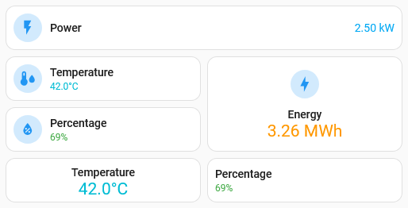
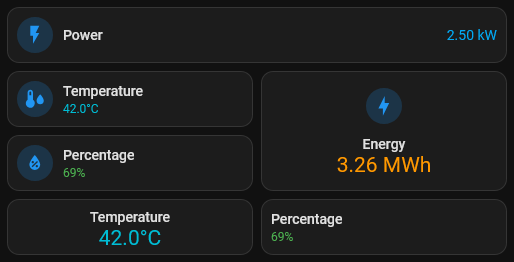

# Formatted Sensor card

## Description

A card specifically designed for sensor entities that supports better formatting to convert the units of to higher orders.

This card has special layout options and allows for colourizing the state. Horizontal layout places the state aligned to the right, with vertical enlarging the size of the state.

## Configuration variables

All the options are available in the lovelace editor but you can use `yaml` if you want.

| Name             | Type     | Default  | Description                                                                                    |
| :--------------- | :------- | :------- | :--------------------------------------------------------------------------------------------- |
| `entity`         | string   | Required | The main entity                                                                                |
| `name`           | string   | Optional | Custom name                                                                                    |
| `data_type`      | DataType | Optional | By default the card attempts to auto-detect. This can be explicitly set as per an option below |
| `state_color`    | string   | Optional | Custom color for state display                                                                 |
| `icon`           | string   | Optional | Custom icon                                                                                    |
| `icon_color`     | string   | `blue`   | Custom color for icon when entity is state is active                                           |
| `layout`         | string   | Optional | Layout of the card. Vertical, horizontal and default layout are supported                      |
| `fill_container` | boolean  | `false`  | Fill container or not. Useful when card is in a grid, vertical or horizontal layout            |
| `show_icon`      | boolean  | `true`   | Show the icon                                                                                  |
| `show_name`      | boolean  | `true`   | Show the name                                                                                  |
| `show_state`     | boolean  | `true`   | Show the state                                                                                 |
| `clamp_negative` | boolean  | `true`   | Clamp negative values to zero                                                                  |

### Configured Data Types

Based on the sensor's Device Class, the card will automatically use a given Data Type. This defines the formatting behaviour of the card. For any other type of sensor, the default formatting in Home Assistant is used.

| EntityType    | Decimals | Units supported           |
| :------------ | :------- | :------------------------ |
| `energy`      | 2        | `Wh`, `kWh`, `MWh`, `GWh` |
| `latency`     | 0        | `ms`                      |
| `percentage`  | 0        | `%`                       |
| `power`       | 2        | `W`, `kW`, `MW`, `GW`     |
| `temperature` | 1        | `°C`                      |
