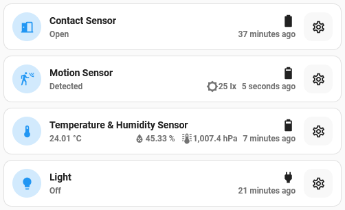
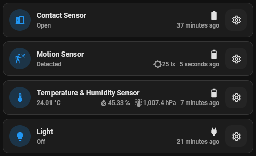

# Sensor card

## Description

A modified entity card that shows the status of the primary entity but also a set of related entities on the same device based on the type of primary entity.
Useful for Contact, Temperature, and Motion sensors.
This will also show the battery/power statusa and last seen time if available

## Configuration variables

All the options are available in the lovelace editor but you can use `yaml` if you want.

| Name                         | Type    | Default  | Description                                                                                              |
| :--------------------------- | :------ | :------- | :------------------------------------------------------------------------------------------------------- |
| `entity`                     | string  | Required | Update entity                                                                                            |
| `name`                       | string  | Optional | Custom name                                                                                              |
| `icon_color`                 | string  | `blue`   | Custom color for icon when entity is state is active                                                     |
| `use_device_name`            | boolean | `true`   | Use the name of the device instead of the entity name. Specifying a custom name will ignore this setting |
| `show_other_device_entities` | boolean | `true`   | If other related entities on the same device are shown as secondary information                          |
| `show_power_status`          | boolean | `true`   | If the power status icon is shown. Either the battery level of a grid icon for non-battery devices       |
| `show_last_seen`             | boolean | `true`   | If the last seen time is shown (if available)                                                            |
