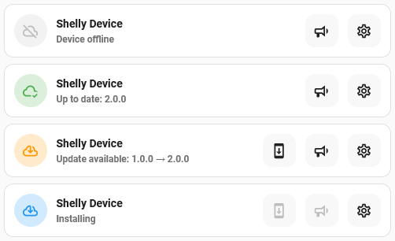
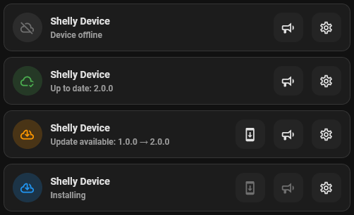

# Shelly Update card

## Description

A modified update card specialised for my Shelly devices. The card shows if an update is available along with a button to install it. Other buttons are available to trigger an announcement and show the device config screen. The controls can be set to only display to Admin users.

## Configuration variables

All the options are available in the lovelace editor but you can use `yaml` if you want.

| Name                     | Type    | Default  | Description                                                                                              |
| :----------------------- | :------ | :------- | :------------------------------------------------------------------------------------------------------- |
| `entity`                 | string  | Required | Update entity                                                                                            |
| `name`                   | string  | Optional | Custom name                                                                                              |
| `use_device_name`        | boolean | `true`   | Use the name of the device instead of the entity name. Specifying a custom name will ignore this setting |
