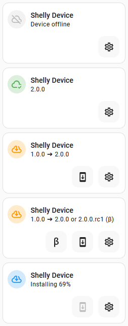
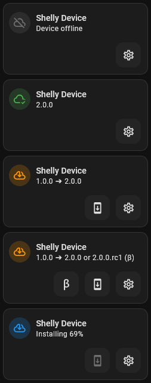

# Shelly card

## Description

A modified update card specialised for my Shelly devices. The card shows if an update is available and makes a button available to trigger the install

Tapping on the main icon (even if offline), will trigger an announcement

A settings button allows quick access to the device info page if the user is an Admin

## Configuration variables

All the options are available in the lovelace editor but you can use `yaml` if you want.

| Name                   | Type    | Default  | Description                                                                                              |
| :--------------------- | :------ | :------- | :------------------------------------------------------------------------------------------------------- |
| `entity`               | string  | Required | Shelly update entity                                                                                     |
| `name`                 | string  | Optional | Custom name                                                                                              |
| `layout`               | string  | Optional | Layout of the card. Vertical, horizontal and default layout are supported                                |
| `fill_container`       | boolean | `false`  | Fill container or not. Useful when card is in a grid, vertical or horizontal layout                      |
| `use_device_name`      | boolean | `true`   | Use the name of the device instead of the entity name. Specifying a custom name will ignore this setting |
| `show_device_controls` | boolean | `true`   | Show the device control buttons                                                                          |
