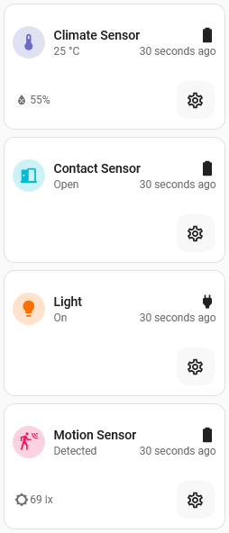
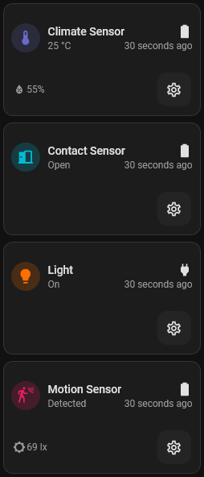

# Zigbee2MQTT card

## Description

A modified entity card that shows the status of the primary entity but also a set of related entities on the same device based on the type of primary entity. The related entities are based on suffixes for the entity ids

Designed for use with Zigbee2MQTT devices such as Contact, Climate, and Motion sensors

This will also show the battery/power status and last seen time if available

A settings button allows quick access to the device info page if the user is an Admin

## Configuration variables

All the options are available in the lovelace editor but you can use `yaml` if you want.

| Name                    | Type       | Default  | Description                                                                                              |
| :---------------------- | :--------- | :------- | :------------------------------------------------------------------------------------------------------- |
| `entity`                | string     | Required | The main entity                                                                                          |
| `name`                  | string     | Optional | Custom name                                                                                              |
| `entity_type`           | EntityType | Optional | By default the card attempts to auto-detect. This can be explicitly set as per an option below           |
| `icon_color`            | string     | `blue`   | Custom color for icon when entity is state is active                                                     |
| `layout`                | string     | Optional | Layout of the card. Vertical, horizontal and default layout are supported                                |
| `fill_container`        | boolean    | `false`  | Fill container or not. Useful when card is in a grid, vertical or horizontal layout                      |
| `use_device_name`       | boolean    | `true`   | Use the name of the device instead of the entity name. Specifying a custom name will ignore this setting |
| `show_related_entities` | boolean    | `true`   | If other related entities on the same device are shown as secondary information                          |
| `show_power_status`     | boolean    | `true`   | If the power status icon is shown. Either the battery level of a grid icon for non-battery devices       |
| `show_last_seen`        | boolean    | `true`   | If the last seen time is shown (if available)                                                            |

### Supported Entity Types

Based on the EntityType, the card will look at the device it belongs to and find other entities with specific suffixes to show that information as secondary on the card

| EntityType     | Default color | Entity suffixes                                                   |
| :------------- | :------------ | :---------------------------------------------------------------- |
| `air_purifier` | `yellow`      | [ `temperature`, `humidity`, `pm2_5`, `motor_speed` ]             |
| `climate`      | `purple`      | [ `temperature`, `humidity`, `pressure`, `battery`, `last_seen` ] |
| `contact`      | `cyan`        | [ `battery`, `last_seen` ]                                        |
| `light`        | `deep-orange` | [ `last_seen` ]                                                   |
| `motion`       | `pink`        | [ `illuminance`, `illuminance_lux`, `battery`, `last_seen` ]      |
